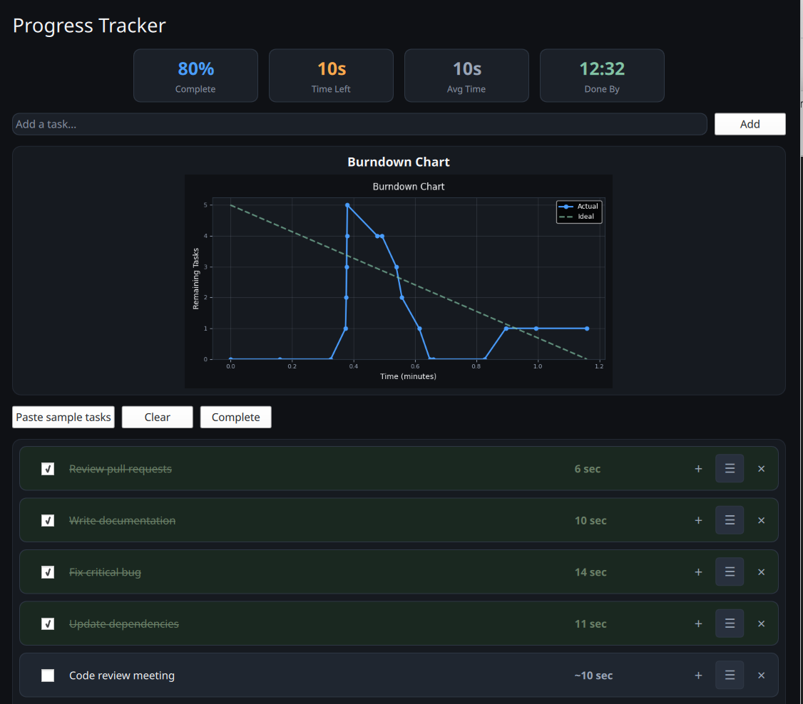

# Progress List

A progress tracking task list with time estimation using PySide6 + QML.



## Features

- ✓ Tasks with checkboxes to mark completion
- ✓ Automatic time tracking for active tasks
- ✓ Estimated completion times based on historical average
- ✓ Break down tasks into subtasks
- ✓ Add new tasks dynamically
- ✓ ActionDraw canvas for system diagrams (database, network, notes)

## ActionDraw Diagramming

Launch the standalone canvas with:

```bash
python actiondraw.py
```

Key capabilities:

- Preset shapes for boxes, databases, servers, clouds, and sticky notes
- Snap-to-grid toggle with optional grid overlay for tidy layouts
- Smooth zoom controls via toolbar, mouse wheel (Ctrl+Scroll), or touchpad pinch
- Drag-and-drop connections with live previews and arrowheads
- Quick resizing gestures (pinch) that respect the grid spacing
- Inline editing for labels plus task integration with the main progress list

## Installation


Latest:

```bash
pip install git+https://github.com/oyvinrog/progress.git
```

Latest stable release:

```bash
pip install progress-list
```

Or install from the repo:

```bash
pip install .
```

## Usage

Run directly from the command line:

```bash
progress-list
```

Or run the module:

```bash
python -m progress_list
```

Launch the ActionDraw canvas:

```bash
actiondraw
```

## Requirements

- Python 3.8+
- PySide6 >= 6.6
- matplotlib >= 3.7.0

## Development

### Install development dependencies

```bash
pip install -r requirements-dev.txt
```

### Run tests

```bash
pytest
```

## License

MIT License - see LICENSE file for details.
