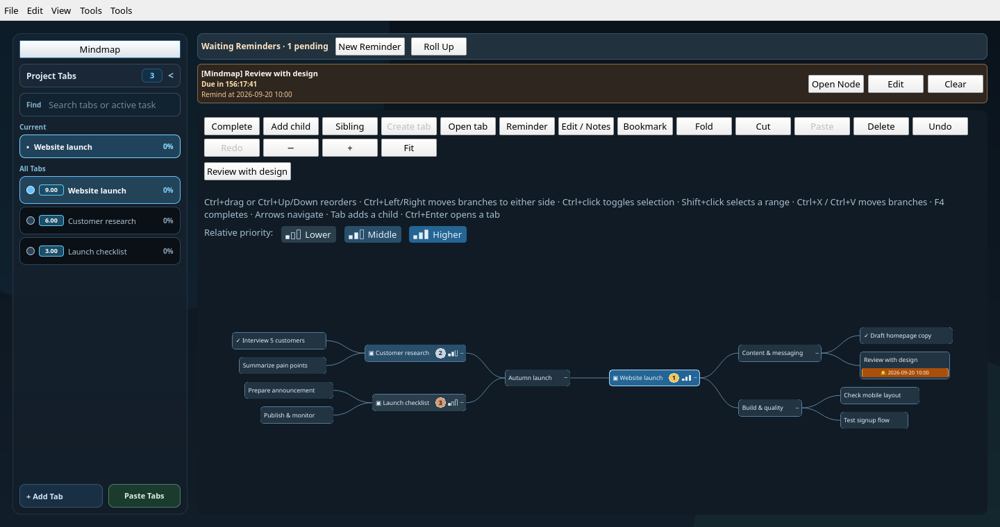
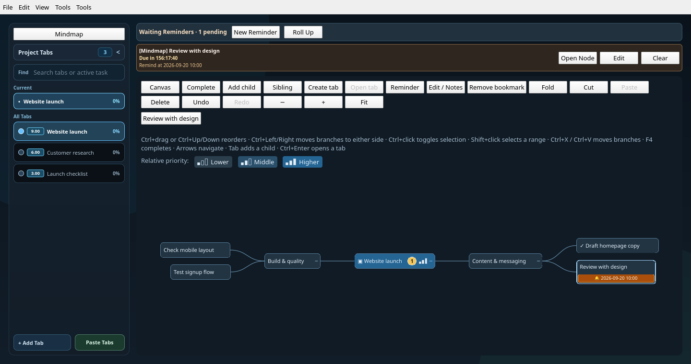
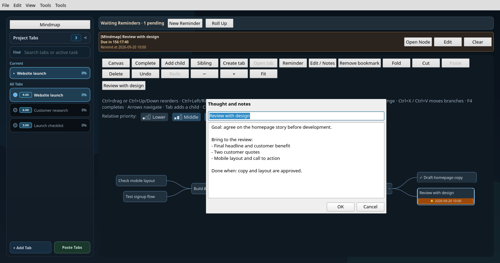
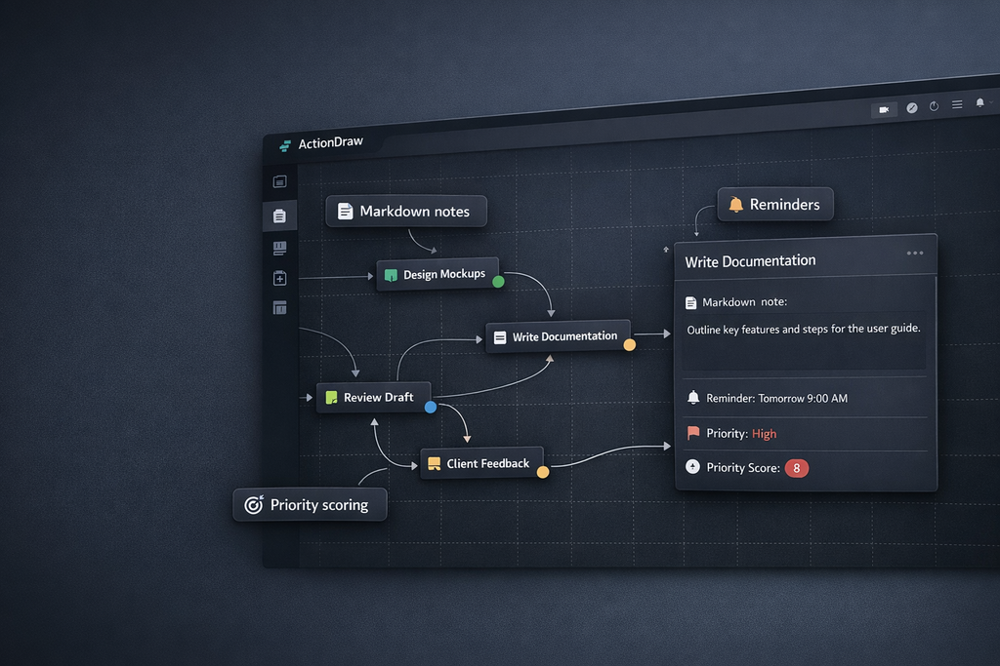

# ActionDraw

**Your whole plan. One canvas.**

ActionDraw is a desktop app for turning ideas into plans you can act on. Organize
projects in a mindmap, open a branch to focus on the next steps, and use visual
canvases, notes, priorities, and reminders to carry the work forward. Save your
work in an encrypted project file.



## Quick start

Requires **Python 3.10+**. Installation includes PySide6 (Qt) and the other required dependencies.

```bash
pip install actiondraw
actiondraw
```

To run the standalone priority plot:

```bash
priorityplot
```

[Mindmap walkthrough](#plan-a-project-with-the-mindmap) ·
[Keyboard shortcuts](#mindmap-shortcuts) ·
[Other tools](#beyond-the-mindmap) ·
[Development](#run-from-source)

## Plan a project with the mindmap

The screenshots use a fictional **Autumn launch** project. Each project tab is
also a node in the map, so you can organize the big picture and open the work
behind it from the same place.

### 1. Lay out the whole project

Choose **Mindmap** above the sidebar tabs to open the full project map. Start
with tabs such as **Website launch**, **Customer research**, and **Launch
checklist**, then select a node and choose **Add child** to break it into smaller
steps. Use **Sibling** for another step at the same level.

In the overview above, the website branch contains content and quality checks,
while research and the launch checklist sit on the left. Drag a node onto
another node to nest it, or onto its top or bottom edge to reorder it. Use the
right-click menu to place a branch on the left or right. Scroll to zoom, drag
the background to pan, and choose **Fit** to see the whole map.

Blue shades and one, two, or three filled bars show lower, middle, or higher
relative priority for tabs included in the priority plot. Numbered badges mark
the top three; hover over a node for its score. The scale compares all included
project tabs, so folding or focusing a branch does not change its priority.
Tied scores share a level; a single task or all-equal scores use the middle level.
Notes and excluded tabs have no priority indicator.

### 2. Open a branch and focus on the next steps

Click a tab node to open it. Tabs with children open their own mindmap branch;
use **Canvas** to switch to that tab's diagram. The tab's **Mindmap** control
opens or starts its branch, while the sidebar **Mindmap** returns to the full
project map. **Alt+Left** returns to the previous view.



Here, **Website launch** is the branch root. The finished homepage draft has a
check mark, and **Review with design** has a reminder. Both the full map and
this focused view edit the same nodes and share undo/redo.

Select a thought and choose **Create tab** when it needs its own workspace.
Use **Bookmark** to keep a frequently visited node within reach; its button
appears above the map.

### 3. Keep context and reminders beside the work

Select a node and choose **Edit / Notes** (or press **F2**) to capture decisions,
questions, and what it will take to finish. In this example, the design review
has an agenda and a clear completion condition.



Choose **Reminder** for a selected node to set a date and time, with optional
notifications. An orange bell and date appear beneath its title. Every node
supports a reminder, including tab nodes and the project root.

**Waiting Reminders** stays visible above both the canvas and mindmap. Choose
**Open Node** to reveal the relevant node, even inside a folded branch. The
right-click menu lets you update or clear its reminder.

Use **Complete** or **F4** to mark selected nodes with a ✓. If all selected
nodes are complete, the same action clears the marks. Completing a node does
not complete its descendants or canvas tasks. Completion marks, notes, and the
map are saved with the project.

Completing or deleting a node cancels its reminder; undo restores it. Reminders
that have already fired stay cleared through undo/redo. Use **Renew** in the
due alert to schedule another one.

### 4. Reorganize as the plan changes

**Ctrl+click** toggles nodes in the selection without opening tabs.
**Shift+click** selects a range, and **Shift+arrow keys** extend the selection.
To move several branches, select them, press **Ctrl+X**, select a destination,
and press **Ctrl+V**. The move preserves descendants and tab links and can be
undone with **Ctrl+Z**.

Cut branches stay dimmed until pasted; **Escape** cancels the cut. Clicking a
tab while a cut is pending selects it as the destination. Cut selections are
local to the current project. Deleting a project tab keeps its map node as a
thought.

## Mindmap shortcuts

These shortcuts apply while the mindmap has focus, outside dialogs and menus.

| Action | Shortcut |
| --- | --- |
| Select a nearby visible node | Arrow keys |
| Extend the selection | Shift + arrow keys |
| Add a child / sibling | Tab / Enter |
| Open the selected tab | Ctrl + Enter |
| Edit title and notes | F2 |
| Fold or unfold | Space |
| Toggle completion | F4 |
| Move a node up / down | Ctrl + Up / Down |
| Place a branch left / right | Ctrl + Left / Right |
| Cut / paste branches | Ctrl + X / Ctrl + V |
| Cancel a pending cut | Escape |
| Undo / redo | Ctrl + Z / Ctrl + Y |
| Return to the previous view | Alt + Left |

## Beyond the mindmap



- **Visual task diagrams** — arrange boxes, databases, servers, clouds, and sticky notes; connect them with arrows that follow the nodes.
- **Markdown notes** — open a rich Markdown editor from a canvas node.
- **Time tracking and reminders** — track work and schedule follow-ups.
- **Priority scoring** — compare tasks by impact and effort in the integrated priority plot.
- **Obstacles and wishes** — use dedicated shapes for blockers and goals.
- **Free drawing and images** — sketch on the canvas and paste external graphics.
- **Action Paint** — sketch a scene, arrange numbered actions, then add them as a connected task chain in the diagram or as nodes in a tab's mindmap.
- **Encrypted storage** — protect project data with Argon2id key derivation, with optional YubiKey challenge-response.

Configure `ntfy` under **Tools > Notification Settings...** for notifications.
`PROGRESS_NTFY_TOPIC`, `PROGRESS_NTFY_SERVER`, and `PROGRESS_NTFY_TOKEN` also work
as environment-variable fallbacks.

## Run from source

```bash
git clone https://github.com/oyvinrog/progress.git
cd progress
python -m venv .venv
source .venv/bin/activate  # Windows: .venv\Scripts\activate
pip install -e ".[dev]"
actiondraw
```

Run the tests with `python -m pytest`.

The mindmap screenshots are captures of the actual QML interface with fictional
sample data. Regenerate all three from a source checkout with:

```bash
python tools/capture_mindmap_screenshots.py
```

The script uses Qt's offscreen software renderer and writes PNGs to `assets/`.
It does not load or save project files.

## Links and license

- [Source on GitHub](https://github.com/oyvinrog/progress)
- [Report an issue](https://github.com/oyvinrog/progress/issues)
- [MIT License](LICENSE)

The mindmap reuses the MIT-licensed [PyPlane](https://github.com/oyvinrog/pyplane)
core, bundled with its [license](actiondraw/_vendor/pyplane/LICENSE) and
[source revision](actiondraw/_vendor/pyplane/UPSTREAM.md).
